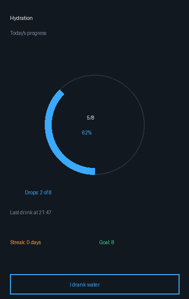
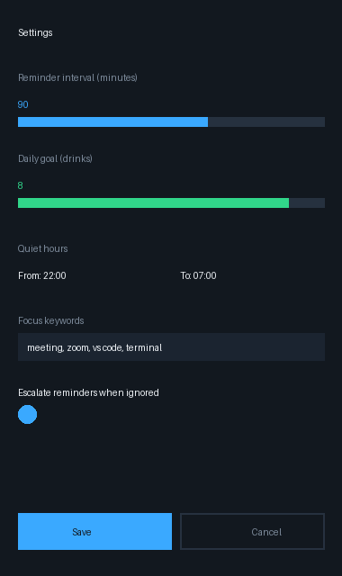
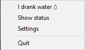
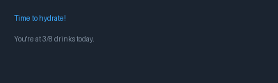

# Remind me to Drink 💧

> A lightweight, intelligent desktop reminder app that helps you stay hydrated throughout the day with **smart skipping**, **escalating alerts**, and **streak tracking**.
>
> **Works offline. Zero telemetry. Open source.**

## ✨ Features

| Feature | Description |
|---------|-------------|
| 🔔 **Smart Reminders** | Get notified every 90 minutes (configurable) to drink water |
| 🌙 **Quiet Hours** | Disable reminders during sleep (default: 10 PM – 7 AM) |
| 🎯 **Focus Mode** | Automatically skip reminders during meetings or focused work sessions |
| 📈 **Escalation** | Reminders get more urgent (gentle → normal → urgent) if you ignore them |
| 🔥 **Streak Tracking** | Track consecutive days you've met your daily goal |
| 🖥️ **System Tray** | Runs silently in the background with a quick-access tray icon |
| 📊 **Daily Goal** | Set a target number of drinks per day with visual progress tracking |

## 🚀 Quick Start

### Option 1: Standalone (Easiest) ⭐
**No Python required!** Just download and run.

1. Download `RemindMeToDrink.exe` from the [releases page](https://github.com/prajjwalnag/remind-me-to-drink/releases)
2. Double-click the `.exe` file
3. Done! A tray icon will appear in your system tray

### Option 2: From Source (Python)
**Requirements:**
- Windows 10 or later
- Python 3.7+

**Steps:**
```bash
# Clone the repository
git clone https://github.com/prajjwalnag/remind-me-to-drink.git
cd remind-me-to-drink

# Install dependencies
pip install -r requirements.txt

# Run the app
python reminder.py
```

The app will create `config.json` and `hydration.db` in the same directory on first run.

### Option 3: Build Your Own Executable
Want to build the `.exe` yourself? Install the build tools and run:

```bash
pip install -r requirements-build.txt
pyinstaller RemindMeToDrink.spec
```

This creates `dist/RemindMeToDrink.exe` (~14 MB, single file, no console window).

## 📸 Screenshots

<details open>
<summary><strong>🎯 Status Window</strong> — See your progress at a glance</summary>



**Shows:** Progress ring (% of daily goal), current streak, last 7 days of history
</details>

<details>
<summary><strong>⚙️ Settings Window</strong> — Customize everything</summary>



**Configure:** Reminder interval, daily goal, quiet hours, focus keywords, escalation
</details>

<details>
<summary><strong>📋 Tray Menu</strong> — Quick access from your taskbar</summary>



**Options:** Log a drink, view status, open settings, quit app
</details>

<details>
<summary><strong>🔔 Alert Notifications</strong> — Smart, escalating reminders</summary>



**Levels:** Gentle → Normal → Urgent (with live drink counter)
</details>

## 📖 How to Use

### 1️⃣ Start the App
```bash
python reminder.py
```
A water droplet icon will appear in your system tray.

### 2️⃣ Log a Drink
**Right-click the tray icon** → Select **"I drank water 💧"**

The app will:
- ✅ Increment your daily drink counter
- 🔥 Update your streak (if you meet the daily goal)
- 📉 Reset escalation level back to gentle

### 3️⃣ Check Your Progress
**Right-click the tray icon** → Select **"Show status"**

View:
- 📊 Today's progress (X/Y drinks with visual ring)
- 🔥 Current streak (consecutive days on goal)
- ⏰ Time of your last drink
- 💧 Quick "I drank water" button in the status window

### 4️⃣ Customize Settings
**Right-click the tray icon** → Select **"Settings"**

Or edit `config.json` directly (see next section)

## ⚙️ Configuration

### Easy Way: Settings Window
**Right-click tray icon** → **"Settings"** → Adjust sliders, times, and keywords → **"Save"**

### Advanced: Edit `config.json`
Located in the same directory as the app.

**Available options:**

| Option | Default | Description |
|--------|---------|-------------|
| `interval_minutes` | 90 | Minutes between reminders |
| `daily_goal` | 8 | Target drinks per day |
| `quiet_hours.start` | 22:00 | Stop reminders at this time |
| `quiet_hours.end` | 07:00 | Resume reminders at this time |
| `focus_keywords` | ["meeting", "zoom", "vs code", "terminal"] | Window titles to skip during |
| `escalation_enabled` | true | Increase urgency for ignored reminders |

**Example configuration:**
```json
{
  "interval_minutes": 60,
  "daily_goal": 10,
  "quiet_hours": {
    "start": "23:00",
    "end": "08:00"
  },
  "focus_keywords": ["meeting", "zoom", "presentation", "call"],
  "escalation_enabled": true
}
```

Changes take effect immediately!

## 🔒 Data Storage

**All data stays on your machine.** No cloud, no telemetry, no tracking.

| File | Purpose |
|------|---------|
| `config.json` | Your settings (interval, goal, quiet hours, focus keywords) |
| `hydration.db` | SQLite database with drink history and streak data |

**What's tracked:**
- Today's drink count and progress
- Current streak (consecutive goal-meeting days)
- Full drink history (last 7 days in status window)
- Last drink timestamp

**Data structure:**
- `state` table: Today's counters, streak, last drink time
- `drink_log` table: One row per day with drink count (auto-archived at midnight)

**Upgrading from older versions?**
If you had an older version using `hydration.json`, the app automatically migrates your data to `hydration.db` on first run. The old file is preserved (not deleted) so you can verify the migration.

## 🔔 Smart Notifications

Reminders escalate in urgency if you keep ignoring them:

| Level | Trigger | Message | Example |
|-------|---------|---------|---------|
| 😊 **Gentle** | 1st ignored reminder | "💧 Sip of water? (1st reminder)" | Polite nudge |
| 📢 **Normal** | 2nd ignored reminder | "💧 Time to hydrate! (3/8 today)" | Shows progress |
| 🚨 **Urgent** | 3rd+ ignored reminder | "🚨 You've ignored 2 reminders—drink now!" | Get serious |

**Reset escalation:** Log a drink and it goes back to "Gentle"

---

## 🆘 Troubleshooting

| Issue | Solution |
|-------|----------|
| **Tray icon not showing** | Ensure `drop.png` is in the app directory |
| **No notifications received** | Enable notifications in Windows Settings (Settings → System → Notifications) |
| **Focus mode not working** | Check that active window title includes your configured focus keywords |
| **App stuck in tray** | Right-click tray icon → **"Quit"** to exit cleanly |
| **Settings not saving** | Ensure `config.json` is writable (check file permissions) |

## 🤝 Contributing

Want to improve the app? Contributions are welcome!

### How to contribute:
1. **Fork** the repository on GitHub
2. **Clone** your fork locally
   ```bash
   git clone https://github.com/YOUR_USERNAME/remind-me-to-drink.git
   ```
3. **Create a feature branch**
   ```bash
   git checkout -b feature/your-feature-name
   ```
4. **Make your changes** and test them
5. **Commit** with a clear message
   ```bash
   git commit -m "Add: description of your feature"
   ```
6. **Push** to your fork and **open a pull request**

### Ideas for contributions:
- 🎨 UI/UX improvements
- 📊 Better statistics and insights
- 🔔 More notification options
- 🌍 Macros/Linux support
- 🐛 Bug fixes
- 📚 Documentation improvements

All contributions are subject to the MIT License.

---

## 📄 License

This project is licensed under the **MIT License** — see the [LICENSE](LICENSE) file for details.

**You are free to:**
- ✅ Use this project for any purpose (personal, commercial, etc.)
- ✅ Modify and distribute it
- ✅ Include it in your own projects

**The only requirement:** Include a copy of the license and copyright notice.

---

## 🎨 Icon Attribution

The water droplet icon is from **Flaticon** and is used under the free license.

Please include attribution when sharing or modifying this project:

**Icon by:** [Icon author name on Flaticon](https://www.flaticon.com/)

(Find the specific author and link from the Flaticon download page where you sourced the icon.)

---

<div align="center">

Made with ❤️ to keep you hydrated

[⭐ Star on GitHub](https://github.com/prajjwalnag/remind-me-to-drink) | [🐛 Report Issues](https://github.com/prajjwalnag/remind-me-to-drink/issues) | [💬 Discussions](https://github.com/prajjwalnag/remind-me-to-drink/discussions)

</div>
